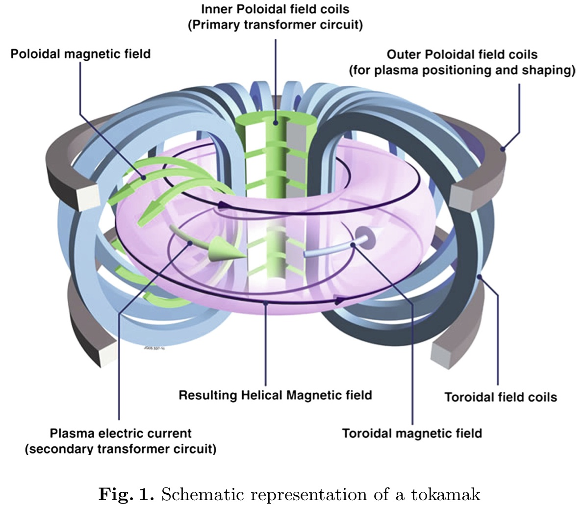

### Control Methods for the Optimization of Plasma Scenarios in a Tokamak

by [Jacques Blum](jacques.blum@unice.fr), et al.

#### Abstract
This paper presents the modelling of the evolution of plasma equilibrium in the presence of external poloidal field circuits and passive structures. The optimization of plasma scenarios is formulated as an optimal control problem where the equations for the evolution of the plasma equilibrium are contraints. The procedure determines the voltages applied to the external circuits that minimize a certain cost-function representing the distance to a desired plasma augmented by an energetic cost of the electrical system. A sequential quadratic programming method is used to solve the minimization of the cost-function and an application to the optimization of a discharge for ITER is shown.

#### Keywords:
Plasma equilibrium, Optimization, Tokamak, Magnetohydrodynamics, Optimal control

#### Introduction
The magnetic filed has two components (as show in Fig. 1)

+ a toroidal field created by toroidal field coils, that is necessary for the stability of the plasma,
+ a poloidal field in the section of the torus created by poloidal field coils and by the plasma itself.

The plasma current is obtained by induction from currents in these poloidal field coils. The tokamak thus appears as a transformer whose plasma is the secondary. **The currents in the external coils play another role, that of creating and controlling the equilibrium of the plasma**. The  goal of this paper is to provide a model for the evolution in time of the equilibrium of the plasma and to derive control methods in order to optimize a typical scenario of a discharge of the plasma in a tokamak.

There are two approaches for simulating a plasma made of electrons and ions:

+ the microscopic approach based on kinetic equations (Vlasov, Boltzmann, Fokker-Planck) that are 6D (3D in space and 3D in terms of the velocity) and 1D in time.
+ the macroscopic approach based on magnetohydrodynamics (MHD) equations that are obtained by taking moments of the kinetic equations, and which are 3D in space and 1D in time. The validity of the MHD equations is clearly more restrictive than the one of the kinetic equations.

1. At the slow **resistive diffusion time-scale**, the plasma is in equilibrium at each instant (the kinetic pressure force balances at each point the Lorentz force due to the magnetic field) and hence **the plasma follows the so-called quasi-static evolution of the equilibrium**. 
2. The resistive diffusion in the external passive struc- tures surrounding the plasma and the equations of the circuits of the poloidal field system enable to follow in time this quasi-static evolution. 
3. An axisymmetric hypothesis enables to reduce the problem to a 2D p.d.e. formulation, with the Grad-Shafranov equation for the equilibrium of the plasma.
4. The **plasma boundary is a free boundary**, which is a particular poloidal flux line.
	+ It is either the outermost closed flux line inside the limiter, which prevents the plasma from touching the vacuum vessel, 
	+ or a **separatrix** (with a hyperbolic X-point), as they are in presence of a poloidal divertor. 

In order to solve numerically the set of equations for the poloidal flux, it is necessary to derive the **weak formulation** of this system and then a **finite element method**, coupled to **Newton iterations** for the treatment of the **non-linearities**, enables to solve the evolution of the equilibrium configuration in a tokamak.

A typical discharge in a tokamak is made of several phases: ramp-up of total plasma current, plateau phase (stationary phase), ramp-down. The plasma shape can also move from a small circular plasma (at the beginning of the discharge) to a large elongated one with an X-point. 

The **goal of this work** is to determine the voltages applied to the poloidal field circuits that achieve at best the desired scenario, by minimizing a certain cost-function which represents the sum of the distance to the desired plasma and of the energetic cost of the electrical system. The introduction of an appropriate lagrangian taking as constraints the equilibrium system of the previous sections and the determination of the corresponding adjoint state enable the computation of the gradient of the cost-function in terms of the adjoint state. The minimization of this cost-function is performed thanks to a SQP (Sequential Quadratic Programming) method.

#### The Magnetohydrodynamic Equations
A  plasma is a ionized gas composed of ions and electrons. The kinetic equations describe the plasma thanks to a distribution function $f_{\alpha}(\mathbf{x},\mathbf{v},t)$ (with $\alpha = e$ for electrons and $\alpha = i$ for ions) where $\mathbf{x}$ is the point position and $\mathbf{v}$ the particles velocity. For a collisional plasma the kinetic equations are based on the Fokker-Planck equation

$$
\frac{\partial f_{\alpha}}{\partial t}+(\mathbf{v} \cdot \nabla_x)f_{\alpha}+\frac{\mathbf{F}_{\alpha}}{m_{\alpha}} \cdot \nabla_{\mathbf v}f_{\alpha}=C_{\alpha}  \qquad (1)
$$

where $m_{\alpha}$ is the mass of the particles, $\mathbf{F}_{\alpha}$ the force applied to these particles and $C_{\alpha}$ the term due to collisions between particles.